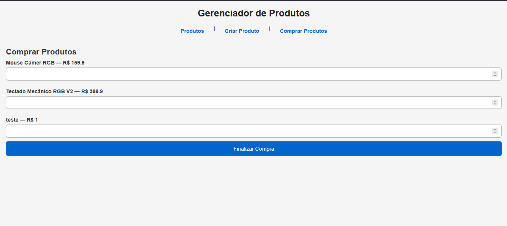
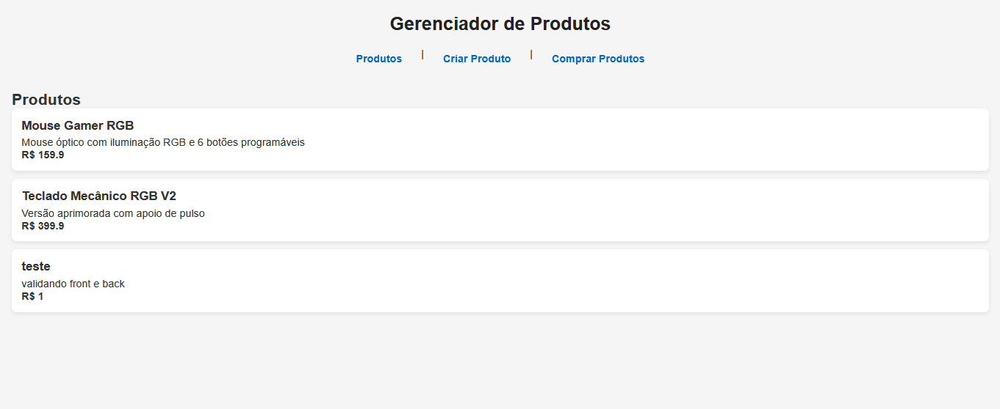

# Gerenciador de Produtos

Projeto front-end em Angular para gerenciamento de produtos — criação, listagem e compra.

**Screenshots**

- Tela: Comprar Produtos

  

- Tela: Criar Produto

  

**Descrição**

- Aplicação: Gerenciador de Produtos (Front-end)
- Tecnologias: Angular, TypeScript
- Estrutura: código em `src/app`, com componentes para produtos e pedidos e serviços em `src/app/services`.

**Executando em desenvolvimento**

1. Instale dependências:

```powershell
npm install
```

2. Inicie a aplicação:

```powershell
npm start
# ou, se preferir usar o Angular CLI diretamente:
ng serve --open
```

A aplicação irá abrir em `http://localhost:4200` por padrão.


